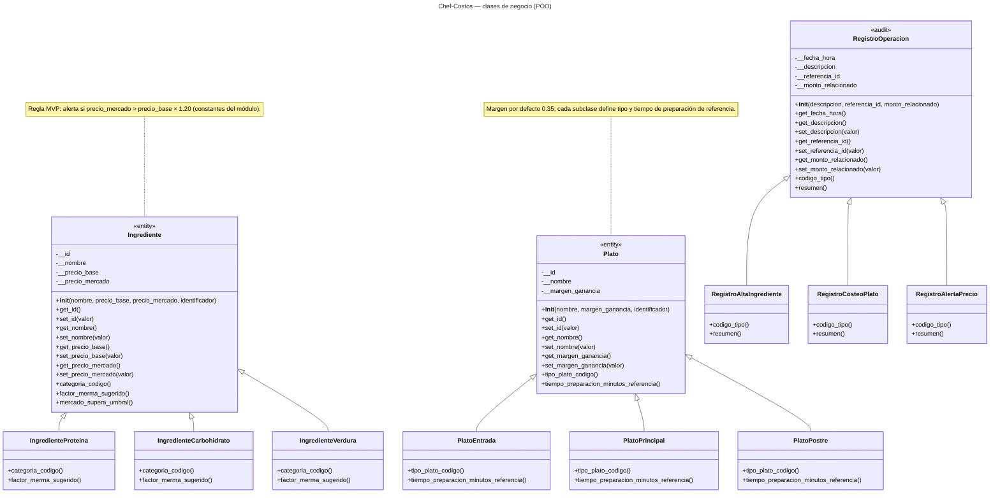
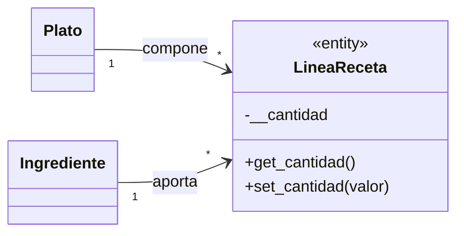

# Diagrama de clases — Chef-Costos (Corte 2)

Modelo **solo de clases de dominio**: **tres jerarquías** (cada una con **tres subclases**), encapsulación con atributos `__` y acceso mediante **getters/setters**

---

## Diagrama principal

---

## Asociación conceptual: plato e ingrediente en la receta

Relación de negocio (un plato se compone de varios ingredientes con una cantidad por línea).

En el código actual del taller, las líneas de receta se persisten en tablas; la clase `LineaReceta` es **opcional** como evolución del modelo de objetos.

---

## Leyenda

| Símbolo / estereotipo | Significado |
|----------------------|-------------|
| `<<entity>>` | Entidad de negocio con estado encapsulado |
| `<<audit>>` | Registro / trazabilidad de operaciones |
| `<\|--` | Herencia (especialización) |

